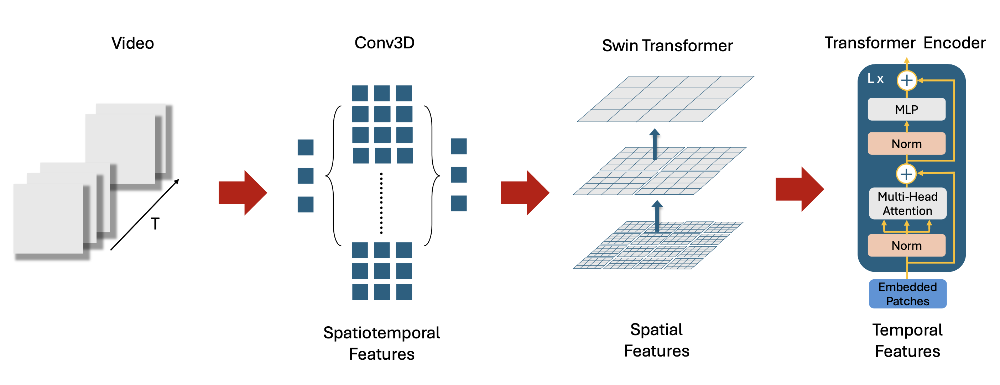

# VideoScenePerception-ViViT

With the increasing complexity of video data in modern applications, there is a growing need for models that can effectively capture both spatial and temporal dependencies. Traditional CNN-based approaches have shown limitations in handling long-range dependencies and global context in video sequences. This study addresses these challenges by exploring the integration of 3D Convolutional Neural Networks (3D CNNs) with the Swin Transformer to develop an advanced video classification model. We introduce a novel hybrid model, the Dual Encoder, which combines the spatiotemporal capabilities of Conv3D layers with the hierarchical attention mechanisms of the Swin Transformer. The model is designed to enhance video classification by effectively capturing complex features within video sequences. Comprehensive experiments, including comparisons with a Single Encoder model and the ResNet3D18 model, validate the effectiveness of the proposed approach. Additionally, visualisation techniques such as 3D Grad-CAM and Attention Rollout are employed to provide deeper insights into the model’s decision-making process. The results demonstrate that the Dual Encoder model significantly outperforms traditional methods in terms of accuracy and interpretability, establishing it as a robust solution for video classification tasks in various domains.

## Manage dataset (Label and split dataset)
dataset_1stream_sinlepply.py
This file is to manage and label the dataset which is already cut into several frames and reshaped into 224 * 224. The dataset is a total of 48 pilots participated in the experiment, with 24 flights classified as well-performing and 24 as poor-performing. Each video has a total duration of 384 seconds, and every 32 seconds segment is treated as a separate data sample. Therefore, there are 576 data samples in total. In this case, only labeled two classes in 1 and 0, and the classification is defined by a professional institute so I just labeled the data only.

## Model Structure (3D CNN + Swin Transformers)
Swin_transformer with conv3D.py
The model is inspired by the ViViT’s factorised encoder architecture but is tailored to enhance video classification by effectively integrating both spatial and temporal encoding. This model leverages three key components:
• Conv3D:
Used for initial feature extraction across spatial and temporal dimensions, providing a foundation of spatiotemporal features.
• Swin Transformer:
Processes individual video frames to capture intricate spatial features, utilising its hierar- chical and self-attention mechanisms.
• Transformer Encoder:
Enhances the model’s capability to understand temporal relationships by processing the sequence of frame features, capturing dependencies across time steps.

Another class is for training and testing.

## Visualise 3D grad-cam and attention rollout map
visualise.py
In this file, to describe the methodologies and results for visualising the decision- making processes of the model used in this project. The focus is on identifying key frames, calculating importance scores, and providing visualisations through techniques such as 3D Grad-CAM and Attention Rollout. These methods offer insights into how the models interpret and prioritize information across the temporal dimension of video data.

